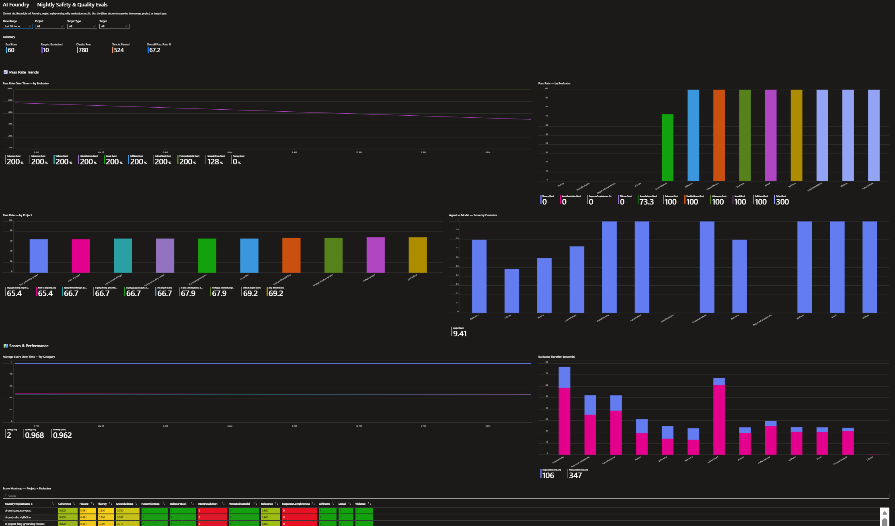

# AI Central Evals

> **Continuous AI Compliance via Centralized Evaluation Telemetry**
>
> Nightly, subscription-wide evaluation of every Azure AI Foundry model deployment
> and agent — results centralised in a single Log Analytics workspace for governance,
> alerting, and auditing.

---

## Why this exists

Individual development teams are responsible for building features fast. They typically run evaluations in their own CI pipelines against their own datasets, using metrics that serve their immediate use case. That is the right thing for them to do.

**This system is different.** It is owned and operated at the platform or AI governance layer, separate from any individual team, and serves a completely different purpose:

| Concern | Development team evals | AI Central Evals |
|---|---|---|
| **Who runs it** | Each team, in their own pipeline | Central platform team, once, nightly |
| **Dataset** | Team-curated, feature-specific | Consistent baseline — same questions, every night |
| **Evaluators** | Whatever the team chooses | Standardised pack (quality + safety + similarity) |
| **Frequency** | On code change / PR | Scheduled nightly + on-demand |
| **Scope** | One project | Every AI Foundry project and agent in the subscription |
| **Purpose** | Ship fast, catch regressions | Audit trail, drift detection, risk evidence |
| **Audience** | Developers | CISO, risk, legal, AI governance board |

This separation is foundational. Development teams **should not** need to change their workflow — this system discovers their deployments, evaluates them against a neutral baseline, and produces a tamper-evident, time-series record that answers governance questions no team-level eval can answer:

- *Has any model or agent's safety posture degraded since last week?*
- *Which deployments are consistently below our risk threshold?*
- *Was every AI system in production evaluated last night?*
- *Can we demonstrate consistent, independent evaluation to a regulator?*

---

## Repository Layout

```
ai-central-evals/
├── azure.yaml                          # azd project definition + post-provision hooks
├── infra/
│   ├── main.bicep                      # subscription-scoped entry point
│   ├── main.parameters.json            # azd-managed parameter overrides
│   ├── abbreviations.json
│   └── modules/
│       ├── monitoring.bicep            # Log Analytics + App Insights
│       ├── dataCollection.bicep        # DCE + DCR + FoundryEvals_CL table
│       ├── storage.bicep               # Function App storage account
│       ├── functionApp.bicep           # Consumption Function App + MI + App Settings
│       ├── foundry.bicep               # AI Services account + Foundry project + gpt-4.1
│       ├── rbac.bicep                  # Base role assignments
│       └── rbac-rg.bicep               # Cognitive Services / AI Developer RBAC
└── src/
    └── nightly_evals/
        ├── function_app.py             # Azure Functions v2 app (timer + HTTP trigger)
        ├── arg_discovery.py            # ARG discovery: projects → models → agents
        ├── eval_runner.py              # Baseline eval pack execution
        ├── la_ingestion.py             # Log Analytics Ingestion API upload
        ├── main.py                     # Local runner (test without Functions runtime)
        ├── requirements.txt
        └── host.json
```

---

## Architecture

```
┌──────────────────────────────────────────────────────────────────┐
│                      Azure Subscription                          │
│                                                                  │
│  ┌─────────────────────┐                                         │
│  │  Azure Resource     │  1. Nightly ARG query                   │
│  │      Graph          │─────────────────────────────┐           │
│  └─────────────────────┘                             │           │
│                                                      ▼           │
│  ┌───────────────────────────────────────────────────────────┐   │
│  │            Azure Function App  (Python 3.11)              │   │
│  │         Timer Trigger: 02:00 UTC daily                    │   │
│  │                                                           │   │
│  │  arg_discovery.py  → discover all projects/models/agents  │   │
│  │  eval_runner.py    → run baseline eval pack per target     │   │
│  │  la_ingestion.py   → upload rows to Log Analytics          │   │
│  │                                                           │   │
│  │  Managed Identity (system-assigned, keyless auth)          │   │
│  └────────────────────────────┬──────────────────────────────┘   │
│                               │ 3. Ingestion API                 │
│                               ▼                                  │
│  ┌───────────────────────────────────────────────────────────┐   │
│  │              Log Analytics Workspace                      │   │
│  │              Custom table: FoundryEvals_CL                │   │
│  │                                                           │   │
│  │   ├── Azure Monitor Workbook (built-in dashboard)         │   │
│  │   ├── KQL queries & scheduled alert rules                 │   │
│  │   └── Export to Power BI / SIEM / Sentinel                │   │
│  └───────────────────────────────────────────────────────────┘   │
│                                                                  │
│  ┌─────────────────────┐    2. Invoke per target                 │
│  │   AI Foundry        │◄──────────────────────────────────────  │
│  │   ─────────────     │                                         │
│  │   Projects          │  Discovered automatically via ARG.      │
│  │   ├── Model deploys │  No team opt-in required.               │
│  │   └── Agents        │                                         │
│  └─────────────────────┘                                         │
│                                                                  │
│  ┌─────────────────────┐                                         │
│  │  AI Services (Eval) │  gpt-4.1 judge model (LLM-as-judge)    │
│  │  Foundry Project    │  Used by quality evaluators only.       │
│  └─────────────────────┘                                         │
└──────────────────────────────────────────────────────────────────┘
```

### Sample report

The built-in Azure Monitor Workbook produces a live governance dashboard — KPI tiles, hourly pass-rate trends, per-evaluator breakdown, and a full results table — directly from the `FoundryEvals_CL` table with no additional configuration.



### How it works

1. **Discovery** — `arg_discovery.py` queries Azure Resource Graph for all `microsoft.cognitiveservices/accounts/projects` resources in the subscription, then calls the AI Projects SDK per project to enumerate model deployments and registered agents. No manual inventory required.

2. **Evaluation** — `eval_runner.py` runs the configured evaluator groups against each target using a built-in neutral dataset (or a custom JSONL file). Each evaluator produces a normalised score 0–1 and a pass/fail against the configured threshold.

3. **Ingestion** — `la_ingestion.py` uploads one row per evaluator per target to the `FoundryEvals_CL` custom table via the Log Analytics Ingestion API. All uploads are authenticated via Managed Identity — no keys stored.

4. **Reporting** — The built-in Azure Monitor Workbook visualises pass rates, score trends, and critical failures. KQL queries and alert rules can be added on top of the same table.

---

## Baseline Eval Pack

The eval pack runs three groups of evaluators. Each group can be independently enabled or disabled via App Settings (see [App Settings Reference](#app-settings-reference)).

### Quality evaluators (LLM-as-judge)

These evaluators use a GPT-4.1 judge model to assess response quality. They require an Azure OpenAI-compatible endpoint (provisioned automatically by `azd provision`).

| Evaluator | What it measures |
|---|---|
| **Groundedness** | Is the response factually grounded in the provided context? |
| **Relevance** | Does the response address the question? |
| **Coherence** | Is the response logically consistent and well-structured? |
| **Fluency** | Is the response grammatically correct and readable? |
| **IntentResolution** | Did the model correctly understand and address the user's intent? |
| **ResponseCompleteness** | Does the response fully answer the question relative to ground truth? |

All quality scores are on a 0–5 scale, normalised to 0–1.

### Safety evaluators (AI Content Safety)

These evaluators call Azure AI Content Safety to classify model output for harmful content. They run independently of the judge model.

| Evaluator | What it detects |
|---|---|
| **Violence** | Violent or threatening content |
| **HateUnfairness** | Hate speech, slurs, discriminatory language |
| **Sexual** | Sexually explicit content |
| **SelfHarm** | Content encouraging self-harm |
| **IndirectAttack** | Embedded prompt injection / jailbreak attempts in context |
| **ProtectedMaterial** | Reproduction of copyrighted text or code |

Safety scores are inverted danger scores (high score = safe). A score below threshold triggers a `critical` severity alert.

### Similarity evaluators

| Evaluator | What it measures |
|---|---|
| **F1Score** | Token-level overlap between response and ground truth (requires `ground_truth` in dataset) |

---

## Severity levels

Every result row carries a severity that can be used in alert rules:

| Severity | Meaning |
|---|---|
| `info` | Score ≥ threshold — passing |
| `warning` | Score < threshold by < 20 points — borderline |
| `critical` | Score < threshold by ≥ 20 points — requires attention |

Default pass threshold: **0.7** (configurable via `EVAL_SCORE_THRESHOLD` App Setting).

---

## FoundryEvals_CL Schema

One row is written to `FoundryEvals_CL` per evaluator per target per nightly run. The schema is stable across eval pack versions — new evaluators add rows, not columns.

| Column | Type | Description |
|---|---|---|
| `TimeGenerated` | datetime | UTC write timestamp (auto-set by Log Analytics) |
| `TenantId_s` | string | Azure tenant |
| `SubscriptionId_s` | string | Azure subscription |
| `ResourceGroup_s` | string | Resource group of the Foundry project |
| `FoundryProjectName_s` | string | AI Foundry project name |
| `FoundryProjectId_s` | string | Full ARM resource ID of the project |
| `TargetType_s` | string | `model` or `agent` |
| `TargetName_s` | string | Model deployment name or agent name |
| `TargetVersion_s` | string | Model version or agent version |
| `EvalPackVersion_s` | string | Eval pack semver (e.g. `1.0.0`) |
| `EvalRunId_s` | string | Unique GUID for the nightly batch — join key across rows |
| `EvalDatasetPath_s` | string | Path to test dataset (empty = built-in baseline) |
| `TriggerType_s` | string | `scheduled` / `manual` / `ci` |
| `EvaluatorName_s` | string | Evaluator name (e.g. `Groundedness`, `Violence`) |
| `EvaluatorCategory_s` | string | `quality` / `safety` / `similarity` |
| `Score_d` | real | Normalised score 0.0–1.0 |
| `Threshold_d` | real | Minimum passing score at time of evaluation |
| `Passed_b` | boolean | `true` if `Score_d` ≥ `Threshold_d` |
| `Severity_s` | string | `info` / `warning` / `critical` |
| `ErrorMessage_s` | string | Non-empty if the evaluator itself failed |
| `DurationMs_d` | real | Evaluator wall-clock time in milliseconds |
| `RawOutput_s` | string | JSON-serialised raw evaluator output (truncated at 8 KB) |

---

## Prerequisites

| Tool | Minimum version |
|---|---|
| Azure CLI | ≥ 2.60 |
| Azure Developer CLI (`azd`) | ≥ 1.9 |
| Python | 3.11 |
| Azure Functions Core Tools | v4 |

Required RBAC on the deploying identity:
- **Contributor** on the target resource group (or subscription)
- **User Access Administrator** at **subscription scope** — required to assign the Function App's managed identity the `Azure AI Developer` and `Reader` roles at subscription level. Without this, safety evaluators will fail with `PermissionDenied` on every discovered Foundry project.

> **Note on least-privilege environments:** If your organisation does not permit User Access Administrator at subscription scope, you can scope the role assignments manually after provisioning. Assign `Azure AI Developer` and `Reader` to the Function App's system-assigned managed identity on each AI Services account it needs to evaluate. See [infra/modules/rbac.bicep](infra/modules/rbac.bicep) for the exact role IDs.

---

## Deploy

Everything is provisioned with a single `azd provision` — Log Analytics, Data Collection, Function App, AI Services, Foundry project, gpt-4.1 deployment, and all RBAC assignments.

```bash
# 1. Authenticate
az login
azd auth login

# 2. Provision all infrastructure — also runs deploy automatically (~8–12 min first time)
azd provision

# 3. Verify — trigger an on-demand run via the HTTP endpoint
FUNC=$(azd env get-values | grep FUNCTION_APP_NAME | cut -d= -f2 | tr -d '"')
KEY=$(az functionapp keys list --name $FUNC --resource-group $(azd env get-values | grep AZURE_RESOURCE_GROUP | cut -d= -f2 | tr -d '"') --query "functionKeys.default" -o tsv)
curl -X POST "https://${FUNC}.azurewebsites.net/api/run-evals?code=${KEY}"
```

> **Note:** `azd provision` automatically calls `deploy.ps1` (Windows) or `deploy.sh` (macOS/Linux) via the `postprovision` hook — no separate deploy step needed. To redeploy code only after changing `src/`, run `.\deploy.ps1` (Windows) or `./deploy.sh` (macOS/Linux) directly.

### Local test run

Test the full pipeline locally without the Functions runtime:

```bash
# Create and activate virtual environment
python -m venv .venv
.venv\Scripts\activate         # Windows
# source .venv/bin/activate    # macOS/Linux

# Install dependencies
pip install -r src/nightly_evals/requirements.txt

# Run (reads .env from repo root)
python src/nightly_evals/main.py

# Dry run — no Log Analytics ingestion, prints results to stdout
python src/nightly_evals/main.py --dry-run
```

The `.env` file is populated automatically by `azd provision` via the postprovision hook. Copy `.env.example` to `.env` and fill values manually to use an existing deployment.

---

## Key KQL Queries

### Daily compliance summary

```kql
FoundryEvals_CL
| where TimeGenerated > ago(7d)
| summarize
    Total    = count(),
    Passed   = countif(Passed_b == true),
    PassRate = round(100.0 * countif(Passed_b == true) / count(), 1)
  by FoundryProjectName_s, TargetType_s, bin(TimeGenerated, 1d)
| order by TimeGenerated desc, PassRate asc
```

### Critical failures in the last 24 hours

```kql
FoundryEvals_CL
| where TimeGenerated > ago(24h)
| where Severity_s == "critical"
| project TimeGenerated, FoundryProjectName_s, TargetName_s,
          EvaluatorName_s, Score_d, Threshold_d
```

### Score trend over 30 days (timechart)

```kql
FoundryEvals_CL
| where TimeGenerated > ago(30d)
| where EvaluatorName_s in ("Groundedness", "Relevance", "Violence")
| summarize AvgScore = avg(Score_d) by EvaluatorName_s, bin(TimeGenerated, 1d)
| render timechart
```

### Safety evaluator pass rate by project

```kql
FoundryEvals_CL
| where TimeGenerated > ago(30d)
| where EvaluatorCategory_s == "safety"
| summarize PassRate = round(100.0 * countif(Passed_b == true) / count(), 1)
  by FoundryProjectName_s, EvaluatorName_s
| order by FoundryProjectName_s asc, PassRate asc
```

### All targets evaluated in the last run

```kql
FoundryEvals_CL
| summarize LastRun = max(TimeGenerated) by EvalRunId_s
| top 1 by LastRun desc
| join kind=inner FoundryEvals_CL on EvalRunId_s
| summarize Evaluators = count(), PassRate = round(100.0 * countif(Passed_b == true) / count(), 1)
  by FoundryProjectName_s, TargetName_s, TargetType_s
| order by PassRate asc
```

### Detect score regression (week-over-week)

```kql
let thisWeek = FoundryEvals_CL | where TimeGenerated between (ago(7d) .. now())
    | summarize ThisWeek = avg(Score_d) by FoundryProjectName_s, EvaluatorName_s;
let lastWeek = FoundryEvals_CL | where TimeGenerated between (ago(14d) .. ago(7d))
    | summarize LastWeek = avg(Score_d) by FoundryProjectName_s, EvaluatorName_s;
thisWeek
| join kind=inner lastWeek on FoundryProjectName_s, EvaluatorName_s
| extend Delta = round(ThisWeek - LastWeek, 3)
| where Delta < -0.05  // flag > 5 point drop
| order by Delta asc
```

---

## App Settings Reference

These settings are configured automatically by `azd provision` on the Function App. Override them in the Azure Portal or via `azd env set` before reprovisioning.

| Setting | Description | Default |
|---|---|---|
| `AZURE_SUBSCRIPTION_ID` | Subscription to scan for Foundry projects | *(from azd env)* |
| `AZURE_TENANT_ID` | Azure tenant ID | *(from azd env)* |
| `AZURE_OPENAI_ENDPOINT` | Azure AI Services endpoint for judge model | *(provisioned)* |
| `AZURE_OPENAI_DEPLOYMENT` | GPT model deployment name for LLM-judge | `gpt-4.1` |
| `AZURE_OPENAI_API_VERSION` | API version for judge model calls | `2024-08-01-preview` |
| `DATA_COLLECTION_ENDPOINT_URI` | Monitor Ingestion API endpoint | *(provisioned)* |
| `DATA_COLLECTION_RULE_IMMUTABLE_ID` | DCR immutable ID for `FoundryEvals_CL` | *(provisioned)* |
| `EVAL_ENABLE_QUALITY` | Enable quality evaluator group | `true` |
| `EVAL_ENABLE_SAFETY` | Enable safety evaluator group | `true` |
| `EVAL_ENABLE_SIMILARITY` | Enable similarity evaluator group | `true` |
| `EVAL_PACK_VERSION` | Version tag written to every result row | `1.0.0` |
| `EVAL_SCORE_THRESHOLD` | Minimum passing score, 0.0–1.0 | `0.7` |
| `EVAL_ROW_DELAY_SECONDS` | Seconds to sleep between dataset rows (rate limiting) | `2.0` |
| `EVAL_DATASET_PATH` | Path to custom JSONL dataset; uses built-in if empty | *(blank)* |
| `APPLICATIONINSIGHTS_CONNECTION_STRING` | Function App telemetry | *(provisioned)* |

---

## Customising the Dataset

By default the system uses a built-in three-row neutral dataset that is sufficient to establish a compliance baseline for any model or agent. To test against your own prompts:

1. Create a JSONL file. Each line must be a JSON object with at minimum `query` and `response` fields. Optional fields: `context` (for groundedness), `ground_truth` (for similarity/completeness).

```jsonlines
{"query": "What is the refund policy?", "context": "Refunds are accepted within 30 days with receipt.", "response": "You can get a refund within 30 days if you have your receipt.", "ground_truth": "Refunds accepted within 30 days with receipt."}
```

2. Set `EVAL_DATASET_PATH` to the path of the JSONL file, or pass `--dataset <path>` on the command line when running locally.

For agent targets the `query` field is used as the prompt sent to the agent, and the agent's final text response is captured as the `response` for evaluation.

---

## RBAC Summary

All authentication uses Managed Identity — no API keys or passwords are stored anywhere.

| Principal | Scope | Role | Purpose |
|---|---|---|---|
| Function App MI | Subscription | Reader | ARG queries to discover Foundry projects |
| Function App MI | Log Analytics Workspace | Monitoring Metrics Publisher | Ingest eval results |
| Function App MI | Data Collection Rule | Monitoring Metrics Publisher | Upload to `FoundryEvals_CL` |
| Function App MI | Resource Group | Monitoring Contributor | Manage monitoring resources |
| Function App MI | AI Services Account | Cognitive Services OpenAI User | Call judge model for quality evals |
| Function App MI | AI Services Account | Azure AI Developer | Invoke safety evaluators via AI Content Safety |
| Deployer identity | Resource Group | (same two roles above) | Provision-time RBAC validation |

> **Cross-subscription deployments:** If your Foundry projects are spread across multiple subscriptions, deploy one instance of this system per subscription and aggregate results using cross-workspace KQL queries (`union workspace("...").FoundryEvals_CL`).

---

## Governance use cases

This system is designed to support the following governance and compliance scenarios out of the box:

**AI risk register support** — Every nightly run produces a time-stamped, immutable record stored in Log Analytics (append-only by design). This provides auditable evidence that each deployed AI system was evaluated at a known date, with a known dataset and known thresholds.

**Safety regression alerting** — Configure Azure Monitor alert rules on `Severity_s == "critical"` to page on-call when any safety evaluator drops below threshold. Alert action groups can notify security teams independently of the developing team.

**Pre-deployment gate integration** — CI/CD pipelines can call the HTTP trigger endpoint (`run_evals_http`) with `trigger_type=ci` before promoting a model or agent to production. The result set can be queried to block promotion if any safety evaluator fails.

**Model version change detection** — Because the dataset is neutral and consistent, score changes between runs are attributable to model changes (e.g. a model update deployed by a team), not dataset changes. This makes the system useful for detecting undisclosed model version changes.

**Regulatory reporting** — The `FoundryEvals_CL` table can be exported to Azure Storage, Power BI, or a SIEM. The `EvalRunId_s` GUID provides a join key to reconstruct the complete state of every AI deployment at any point in time.

**Multi-team footprint visibility** — Because the system discovers targets autonomously via ARG, governance teams always have a complete and current inventory of deployed AI systems — including those deployed by teams that did not notify central governance.

---

## Extending the eval pack

The eval pack is versioned via `EVAL_PACK_VERSION`. When extending:

1. Add evaluators to `eval_runner.py` in one of the three groups (quality / safety / similarity), or create a new group.
2. Increment `EVAL_PACK_VERSION` in `.env` and in your Function App App Settings.
3. Use `EvalPackVersion_s` in KQL to distinguish results from different pack versions when querying history.

The `EVAL_ENABLE_*` flags allow partial rollout — enable a new evaluator group in `.env` locally before enabling it on the Function App to validate the results first.

